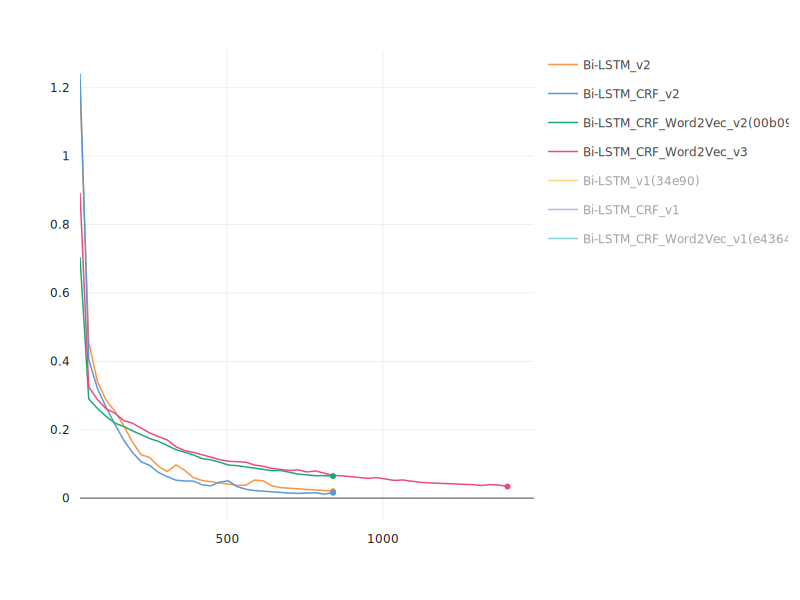
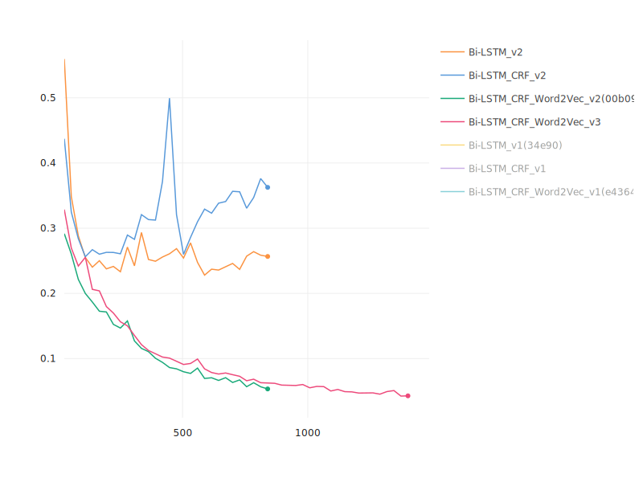
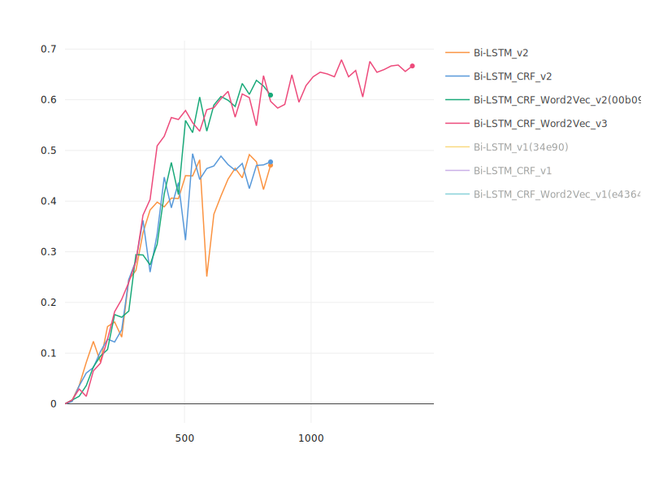

# NER

## About dataset
Entities are (`ལུང་ཁུངས།`, `ལུང་དེའི་མཛད་པ་པོ།`, `ལུང་ཚིག་དངོས།`) and annotation scheme used for this task is `BIO`.

`Note`: We have used [Pybo](https://github.com/esukhia/pybo) for work tenization and [lighttag](https://www.lighttag.io/) for text annotation.

# Results
## Citation Detection Models Comparison
|Model                  |Test f1|
|-----------------------|-------|
|Memorization_v1        |2.2032	|
|Bi-LSTM_v2             |34.56	 |
|Bi-LSTM_CRF_v2         |31.92  |
|Bi-LSTM_CRF_Word2Vec_v2|54.09	 |
|Bi-LSTM_CRF_Word2Vec_v3|63.41  |

`Note`: 
- F1-score is based on mertic used for CoNLL-2000. We have used [seqeval](https://github.com/chakki-works/seqeval) package for measuring the F1-score.
- `v2` and `v3` model trained for `30` and `50` epochs respectively.

### Graphs
- Training loss

  - Training loss is much higher for `Bi-LSTM_CRF_Word2Vec_v3` at the end
- Validation loss

  - Validation loss is very stable for `Bi-LSTM_CRF_Word2Vec` models over the steps
- Validation F1

  - Validation f1 is very stable for `Bi-LSTM_CRF_Word2Vec` models over the steps
# Prediction
Output 1:
```
Word           ||True ||Pred
==============================
....
འོ             : O     O
བསྡོགས་        : O     O
དུས་འཁོར་      : B-ལུང་ཁུངས། B-ལུང་ཁུངས།
རྩ་རྒྱུད་      : O     I-ལུང་ཁུངས།
ལ              : O     O
ས              : O     O
བསྡོགས་        : O     O
སོ་སོ          : B-ལུང་ཚིག་དངོས། B-ལུང་ཚིག་དངོས།
ར་             : I-ལུང་ཚིག་དངོས། I-ལུང་ཚིག་དངོས།
སྡུད་          : I-ལུང་ཚིག་དངོས། I-ལུང་ཚིག་དངོས།
དང་            : I-ལུང་ཚིག་དངོས། I-ལུང་ཚིག་དངོས།
བསམ་གཏན་       : I-ལུང་ཚིག་དངོས། I-ལུང་ཚིག་དངོས།
དང་            : I-ལུང་ཚིག་དངོས། I-ལུང་ཚིག་དངོས།
བསྡོགས་        : I-ལུང་ཚིག་དངོས། I-ལུང་ཚིག་དངོས།
སྲོག་          : I-ལུང་ཚིག་དངོས། I-ལུང་ཚིག་དངོས།
རྩོལ་          : I-ལུང་ཚིག་དངོས། I-ལུང་ཚིག་དངོས།
དེ་བཞིན་       : I-ལུང་ཚིག་དངོས། I-ལུང་ཚིག་དངོས།
འཛིན་པ་        : I-ལུང་ཚིག་དངོས། I-ལུང་ཚིག་དངོས།
དང་            : I-ལུང་ཚིག་དངོས། I-ལུང་ཚིག་དངོས།
བསྡོགས་        : I-ལུང་ཚིག་དངོས། I-ལུང་ཚིག་དངོས།
རྗེས་སུ་       : I-ལུང་ཚིག་དངོས། I-ལུང་ཚིག་དངོས།
དྲན་           : I-ལུང་ཚིག་དངོས། I-ལུང་ཚིག་དངོས།
དང་            : I-ལུང་ཚིག་དངོས། I-ལུང་ཚིག་དངོས།
ཏིང་ངེ་འཛིན    : I-ལུང་ཚིག་དངོས། I-ལུང་ཚིག་དངོས།
བསྡོགས་        : I-ལུང་ཚིག་དངོས། I-ལུང་ཚིག་དངོས།
སྦྱོར་བ་       : I-ལུང་ཚིག་དངོས། I-ལུང་ཚིག་དངོས།
ཡན་ལག་         : I-ལུང་ཚིག་དངོས། I-ལུང་ཚིག་དངོས།
དྲུག་          : I-ལུང་ཚིག་དངོས། I-ལུང་ཚིག་དངོས།
ཅེས་           : I-ལུང་ཚིག་དངོས། I-ལུང་ཚིག་དངོས།
བྱ             : I-ལུང་ཚིག་དངོས། I-ལུང་ཚིག་དངོས།
བསྡོགས་        : I-ལུང་ཚིག་དངོས། I-ལུང་ཚིག་དངོས།
ཞེ             : O     O
ས་             : O     O
....
```
Output 2:
```
Word           ||True ||Pred
==============================
....
ཁུངས་          : O     O
ནི             : O     O
བསྡོགས་        : O     O
དམ་ཚིག་        : B-ལུང་ཁུངས། B-ལུང་ཁུངས།
ལྔ་            : I-ལུང་ཁུངས། I-ལུང་ཁུངས།
པ་             : O     I-ལུང་ཁུངས།
ལ              : O     O
ས              : O     O
བསྡོགས་        : O     O
དེ             : B-ལུང་ཚིག་དངོས། B-ལུང་ཚིག་དངོས།
ས་             : I-ལུང་ཚིག་དངོས། I-ལུང་ཚིག་དངོས།
ཀྱང་           : I-ལུང་ཚིག་དངོས། I-ལུང་ཚིག་དངོས།
རང་རིག་        : I-ལུང་ཚིག་དངོས། I-ལུང་ཚིག་དངོས།
མ་ལ་           : I-ལུང་ཚིག་དངོས། I-ལུང་ཚིག་དངོས།
འཁྱུད          : I-ལུང་ཚིག་དངོས། I-ལུང་ཚིག་དངོས།
བསྡོགས་        : I-ལུང་ཚིག་དངོས། I-ལུང་ཚིག་དངོས།
མི་            : I-ལུང་ཚིག་དངོས། I-ལུང་ཚིག་དངོས།
ནུས་           : I-ལུང་ཚིག་དངོས། I-ལུང་ཚིག་དངོས།
བསམ་གཏན་       : I-ལུང་ཚིག་དངོས། I-ལུང་ཚིག་དངོས།
དག་            : I-ལུང་ཚིག་དངོས། I-ལུང་ཚིག་དངོས།
གི             : I-ལུང་ཚིག་དངོས། I-ལུང་ཚིག་དངོས།
ས་             : I-ལུང་ཚིག་དངོས། I-ལུང་ཚིག་དངོས།
བྱ             : I-ལུང་ཚིག་དངོས། I-ལུང་ཚིག་དངོས།
བསྡོགས་        : O     I-ལུང་ཚིག་དངོས།
ཞེ             : O     O
ས་             : O     O
....
```
